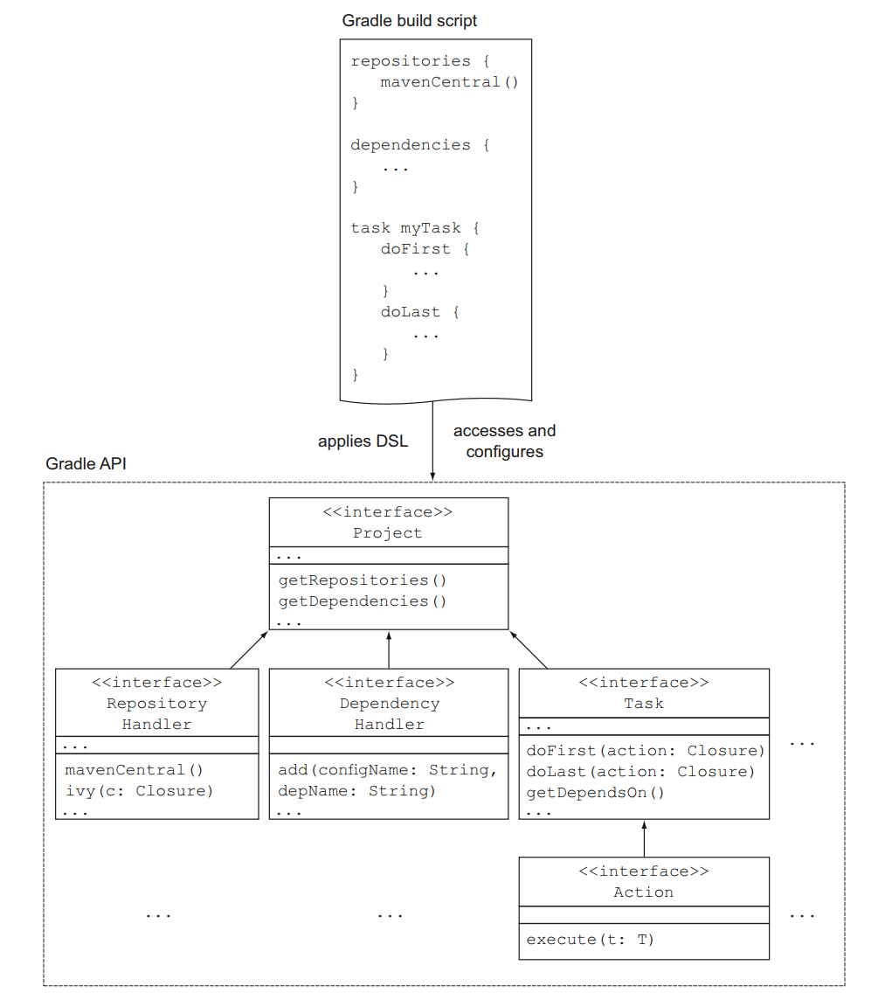
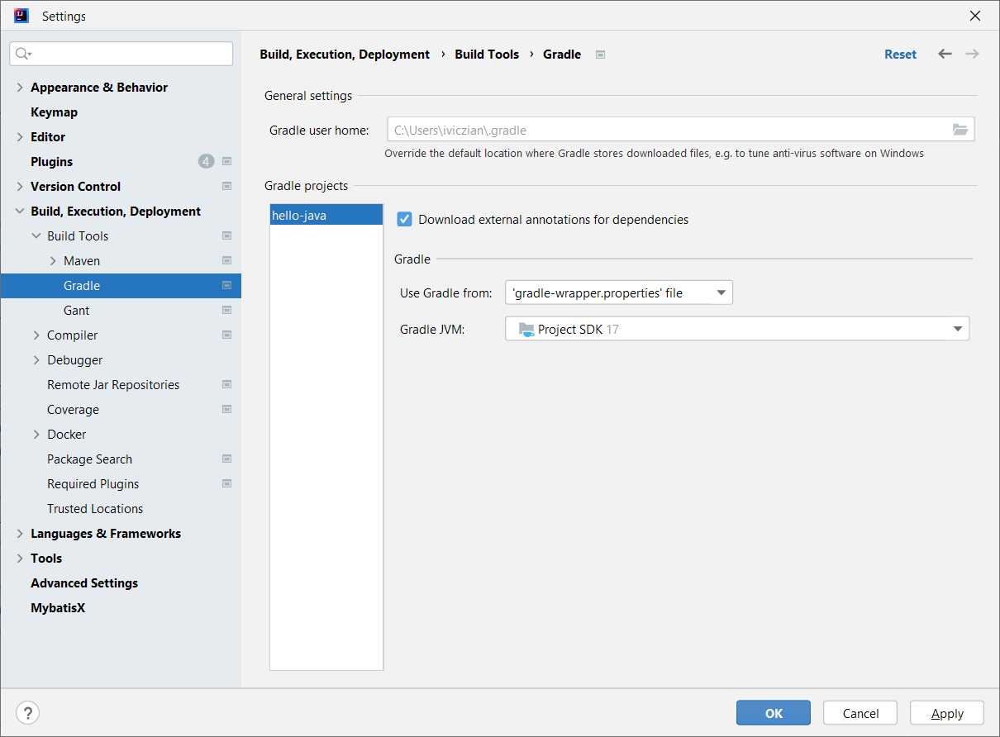

class: inverse, center, middle

# Java projektek Gradle-lel

---

## Gradle jellemzői

* Incremental compilation
* Incremental build
* Több programozási nyelv és platform támogatása
* Dependency management, repository kezelés
* Multimodule
* Profiles (különböző artifact különböző környezetekre?)
* Bővíthetőség: plugin
* Artifact release és deploy (repo-ba)

---

## Maven vs. Gradle

https://gradle.org/maven-vs-gradle/

* Maven
  * De facto standard, szélesebb körben elterjedt
  * Nehéz testreszabni
* Gradle
  * Nagyobb flexibilitás
  * Inkrementális build, csak a megváltozott osztályokat fordítja le újra
    * Ennek megfelelően a megfelelő taskokat is képes átugorni
    * Multimodule projekteknél is működik: partial build
  * Nagyra növő multimodule projektekhez
  * Groovy DSL tömörebb, mint az XML

---

class: inverse, center, middle

# Első Gradle task

---

## Gradle tulajdonságok

* Groovy-based DSL
* Taskok gráfja (DAG - directed acyclic graph)
* Sok konvenció megegyezik a Mavennel, de flexibilisebben

---

## Gradle felépítés

* Alapfogalma a _project_ melynek építőelemei a _task_-ok
* Hogy ne kelljen a taskokat újra megírni és másolgatni, vannak a pluginok
  * [Java plugin](https://docs.gradle.org/current/userguide/java_plugin.html)

---

## Gradle API



---

## Gradle telepítés

* Kicsomagolni
* `PATH` módosítása

```shell
gradle -v
```

---

## Gradle Script alapok

* Ritkán van rá szükség, csak megértéshez és kiterjesztéshez
* Projekt főkönyvtárában `build.gradle` fájl

```groovy
tasks.register('hello') {
  group 'Demo'
  description 'Prints a welcome message.'
  doLast {
    println 'Hello world!'
  }
}
```

https://docs.gradle.org/current/javadoc/index.html

https://groovy-lang.org/style-guide.html

---

## Gradle futtatás

Futtatás:


```shell
gradlew -q hello
```

Taskok listázása:

```shell
gradlew tasks 
```

---

class: inverse, center, middle

# További taskok és közöttük lévő függőségek

---


## Task függőségek

```groovy
tasks.register('hello') {
* dependsOn tasks.intro
  group 'Demo'
  description 'Prints a welcome message.'
  doLast {
    println 'Hello world!'
  }
}

tasks.register('intro') {
    doLast {
        println "I'm Gradle"
    }
}
```

---

## Default task

```groovy
*defaultTasks 'hello'

tasks.register('hello') {  
  dependsOn tasks.intro
  group 'Demo'
  description 'Prints a welcome message.'
  doLast {
    println 'Hello world!'
  }
}

tasks.register('intro') {
    doLast {
        println "I'm Gradle"
    }
}
```

```shell
gradlew -q
```

https://docs.gradle.org/current/userguide/tutorial_using_tasks.html

---

## Task függőségek felderítése

```shell
gradlew hello --dry-run
```

---

class: inverse, center, middle

# Egyszerű Java projekt

---

## Plugins

* Eltérni a konvencióktól nem szerencsés
* Biztos szükség van egyedi fejlesztésre?
  * _Not invented here_

---

## Gradle plugins

https://plugins.gradle.org/

https://docs.gradle.org/current/userguide/java_plugin.html

---

## Legegyszerűbb build.gradle fájl

```groovy
plugins {
   id 'java'
}
```

* Forrásfájl a `src/main/java` könyvtárban
* `gradle build`

---

## Lifecycle

Nincs, csak plugin szinten


---

## Futtatás

```shell
gradle build
gradle clean build
gradle jar
gradle --console=plain build
```

---

## Gradle daemon

```shell
gradlew --status
gradlew --stop
```

---

## Java version

* Java toolchain
* Detects locally installed JVMs
* If no matching JVM is found, it will automatically download a matching JDK from AdoptOpenJDK
* https://docs.gradle.org/current/userguide/toolchains.html
* https://kordamp.org/enforcer-gradle-plugin/

```shell
gradle -q javaToolchains
```

```groovy
java {
    toolchain {
        languageVersion = JavaLanguageVersion.of(17)
    }
}
```

---

## IDEA-ban



---

## JavaDoc

```shell
gradle javadoc
```

---

## Encoding

```groovy
/**
 * 1st approach: Setting encoding during compilation in Java and Test classes
 */
compileJava.options.encoding = "UTF-8"
compileTestJava.options.encoding = "UTF-8"

/**
 * 2nd approach: Setting encoding during compilation in Java and Test classes
 *
tasks.withType(JavaCompile) {
	options.encoding = "UTF-8"
}
tasks.withType(Test) {
	systemProperty "file.encoding", "UTF-8"
}
 */
```

---

## Futtatható JAR


```groovy
jar {
    manifest {
        attributes 'Main-Class': 'hello.Hello'
    }
}
```

---

class: inverse, center, middle

# Tesztesetek

---

## Tesztesetek

```groovy
repositories {
	mavenCentral()
}

test {
    useJUnitPlatform()
}

dependencies {
    testImplementation 'org.junit.jupiter:junit-jupiter-api:5.9.1'
    testRuntimeOnly 'org.junit.jupiter:junit-jupiter-engine:5.9.1'
}
```

---

## Kiíratás

```shell
gradle test -i
```

Plugin:

```groovy
plugins {
    id 'com.adarshr.test-logger' version '3.2.0'
}
```

---

## Szűrés

```groovy
test {
    useJUnitPlatform {
    	includeTags 'fast'
        excludeTags 'slow'
    }
}
```

---

class: inverse, center, middle

# Tesztlefedettség Jacocoval

---

## Tesztlefedettség

```groovy
plugins {
  id 'jacoco'
}

test {
  useJUnitPlatform()
  finalizedBy jacocoTestReport
}

jacoco {
  toolVersion = "0.8.7"
}

jacocoTestReport {
  dependsOn test // tests are required to run before generating the report
}

```

---

class: inverse, center, middle

# Függőségek

---

## Új függőség

```groovy
dependencies {
    def zxingVersion = "3.5.0"
    implementation "com.google.zxing:core:${zxingVersion}"
    implementation "com.google.zxing:javase:${zxingVersion}"

    def lombokVersion = "1.18.24"
    compileOnly "org.projectlombok:lombok:${lombokVersion}"
    annotationProcessor "org.projectlombok:lombok:${lombokVersion}"
}
```

---

## Alternatív megadási mód

```groovy
implementation group: 'org.springframework', name: 'spring-core', version: '2.5'
```

---

## Fat JAR

```groovy
plugins {
  id 'com.github.johnrengelman.shadow' version '7.1.2'
}
```


```shell
gradle shadowJar
```

---

class: inverse, center, middle

# Gradle init

---

## Új alkalmazás létrehozása

---

## Létező Maven alkalmazás migrálása

---

class: inverse, center, middle

# Spring Boot alkalmazás Gradle-lel

---

# Új projekt

http://start.spring.io

---

class: inverse, center, middle

# Gradle függőségek

---

## Dependency

* GAV koordináták: groupID, artifactID, version
* [Semantic versioning](https://semver.org/)
* Tranzitív függőségek
* Dependency hell

---

## Gradle függőségkezelés

* A függőségek _dependency configuration_-ökbe vannak szervezve, [részletesen](https://docs.gradle.org/current/userguide/java_plugin.html#sec:java_plugin_and_dependency_management)

* compileOnly — for dependencies that are necessary to compile your production code but shouldn’t be part of the runtime classpath
* implementation (supersedes compile) — used for compilation and runtime
* runtimeOnly (supersedes runtime) — only used at runtime, not for compilation
* testCompileOnly — same as compileOnly except it’s for the tests
* testImplementation — test equivalent of implementation
* testRuntimeOnly — test equivalent of runtimeOnly

```shell
# Függőségi fa listázása
gradlew -q dependencies
```

Függőségek könyvtára: `~/.gradle/caches/modules-2/files-2.1`

---

## Függőség intervallumok

* Nem javasolt
* Nem reprodukálható build
* Manuálisan

---

## Gradle Versions Plugin

* [Gradle Versions Plugin](https://github.com/ben-manes/gradle-versions-plugin)

```groovy
plugins {
  id 'com.github.ben-manes.versions' version '0.38.0'
}
```

```shell
gradlew dependencyUpdates
```

---

## Overriding transitive dependency versions

```groovy
dependencies {
    implementation 'org.apache.httpcomponents:httpclient:4.5.4'
    implementation('commons-codec:commons-codec') {
        version {
            strictly '1.9'
        }
    }
}
```

---

## Excluding transitive dependencies

```groovy
dependencies {
    implementation('commons-beanutils:commons-beanutils:1.9.4') {
        exclude group: 'commons-collections', module: 'commons-collections'
    }
}
```

---

## JAR hell futás időben

* [JHades](http://jhades.github.io/)
* `ClassNotFoundException` / `NoClassDefFoundError` kivételek megjelenésekor
* Az alkalmazás működik az egyik környezetben, de nem működik a másikon
* Az alkalmazás működik az egyik alkalmazásszerveren, de nem működik a másikon
* Ha módosítasz az alkalmazáson, és redeploy után nem látod a módosítást
* Ha az alkalmazás nem működik új függőség bevezetésekor, vagy egy függőség verziójának megváltoztatásakor

---

class: inverse, center, middle

# Projekteken átívelő függőségek

---

## Projekteken átívelő függőségek

* Előnye: ugyanazok a függőségek a különböző projektekben
* Hátránya: szoros függőség
* Egy helyen deklarálni a függőségek verzióit 
  * BOM - bill of materials
* Vigyázzunk a különböző projektek között megosztott saját függőségekkel
  * Pl. entitások, API osztályok, stb.

---

## Gradle projekten átívelő <br /> függőségek

* [Gradle Dependency Management Plugin](https://github.com/spring-gradle-plugins/dependency-management-plugin)
* Spring kapcsán fejlesztették ki
* Ezt használja a [Spring Boot Gradle Plugin](https://docs.spring.io/spring-boot/docs/2.4.3/gradle-plugin/reference/htmlsingle/)

---

class: inverse, center, middle

# Annotation processor

---

## Lombok és MapStruct együttműködése

https://stackoverflow.com/questions/47676369/mapstruct-and-lombok-not-working-together
https://mapstruct.org/faq/#Can-I-use-MapStruct-together-with-Project-Lombok

---

class: inverse, center, middle

# Integrációs tesztek külön lépésként

---


## Integrációs tesztek - Gradle

https://docs.gradle.org/current/userguide/java_testing.html#sec:configuring_java_integration_tests

Új könyvtár: `src/integration`, az alatt ugyanúgy `java` és `resources`

* Új source set
  * Forráskód logikai csoportosítása: alkalmazás kód, unit teszt, integrációs teszt
* Új classpath-ok létrehozása, új függőségek felvétele
* Új task létrehozása

---

## Integrációs tesztek konfiguráció

.small-code-14[
```groovy
sourceSets {
    integrationTest {
        java.srcDir "$projectDir/src/integration/java"
        resources.srcDir "$projectDir/src/integration/resources"
        compileClasspath += main.output
        runtimeClasspath += main.output
    }
}

configurations {
    integrationTestImplementation.extendsFrom implementation
    integrationTestRuntimeOnly.extendsFrom runtimeOnly
}

dependencies {
	integrationTestImplementation('org.springframework.boot:spring-boot-starter-test') {
		exclude group: 'org.junit.vintage', module: 'junit-vintage-engine'
	}

  integrationTestImplementation 'io.rest-assured:json-path'
  integrationTestImplementation 'io.rest-assured:json-schema-validator'
  integrationTestImplementation 'io.rest-assured:rest-assured'
  integrationTestImplementation 'io.rest-assured:spring-mock-mvc'
}
```
]

---

## Integrációs tesztek task

```groovy
tasks.register('integrationTest', Test) {
    description = 'Runs integration tests.'
    group = 'verification'

    useJUnitPlatform()

    testClassesDirs = sourceSets.integrationTest.output.classesDirs
    classpath = sourceSets.integrationTest.runtimeClasspath
    shouldRunAfter test
    finalizedBy jacocoTestReport
}
```

---

## Jacoco reportban is benne legyen

```groovy
jacocoTestReport {
   getExecutionData().setFrom(fileTree(buildDir).include("/jacoco/*.exec"))
}
```

---

## The JVM Test Suite Plugin

https://docs.gradle.org/current/userguide/jvm_test_suite_plugin.html#jvm_test_suite_plugin

---

class: inverse, center, middle

# SonarQube

---

## Gradle integráció

https://docs.sonarqube.org/latest/analysis/scan/sonarscanner-for-gradle/

```groovy
plugins {
    id "org.sonarqube" version "3.1.1"
}
```

```groovy
sonarqube {
    properties {
        property "sonar.projectName", "employees"
        property "sonar.projectKey", "training:employees"
        property "sonar.jacoco.xmlReportPath", "${project.buildDir}/reports/jacoco/test/jacocoTestReport.xml"
        property "sonar.login", "admin"
	property "sonar.password", "admin12"
    }
}
```

---

## Gradle properties


---

## Futtatás

```shell
./gradlew sonarqube 
```

---

class: inverse, center, middle

# Multi-project build

---

## Multi-project build

* Funkciónként
* Rétegenként
* Monolit, de modularizált alkalmazásoknál
  * Jól definiált függőségek, míg nem volt Java Platform Module System
* Egyben buildelhető, release-elhető
  * Párhuzamosság
* Microservice-ek esetén jelentőségét vesztette
* Nagyon meg kell gondolni, hogy szükség van-e rá


---

## Multi-project build and integration tests

The JVM Test Suite Plugin https://docs.gradle.org/current/userguide/jvm_test_suite_plugin.html#jvm_test_suite_plugin
Közös konfiguráció subprojectekre: https://stackoverflow.com/questions/55402064/gradle-multi-project-integration-tests-with-junit5
Pluginnel: https://docs.gradle.org/current/samples/sample_jvm_multi_project_with_additional_test_types.html

---

class: inverse, center, middle

# Lib fejlesztése

---

## Java application vagy library

* `java-library` plugin library fejlesztéshez
* API és implementáció különválasztásához

https://docs.gradle.org/current/userguide/java_library_plugin.html


---

class: inverse, center, middle

# Release Gradle-lel

---

## Gradle release

* [Gradle release plugin](https://github.com/researchgate/gradle-release)

---

## Gradle release plugin lépések

* Nem commitolt fájlok ellenőrzése
* Bejövő vagy kimenő módosítások ellenőrzése
* Eltávolítja a `SNAPSHOT` részt a verziószámból
* Megkérdezi a release verziószámot
* Ellenőrzi, hogy van-e `SNAPSHOT` függőség
* Buildeli a projektet
* Commitol, ha történt verziószám módosítás (`SNAPSHOT` eltávolítás)
* Készít egy release taget
* Megkérdezi a következő verziót
* Commitolja

---

## Gradle release plugin <br /> paraméterezés

```shell
gradle release -Prelease.useAutomaticVersion=true  
	-Prelease.releaseVersion=1.0.0 -Prelease.newVersion=1.1.0-SNAPSHOT
```


---

class: inverse, center, middle

# Gradle wrapper

---


## Gradle wrapper


* Nem kell a gépen telepíteni Gradle-t
* Képes párhuzamosan több Gradle verziót kezelni
* `gradle/wrapper/gradle-wrapper.jar` - tölti le a fájlt
* `gradle/wrapper/gradle-wrapper.properties` - tartalmazza a verziószámot
  * Reprodukálható build

---

## Parancsok

Wrapper létrehozása

```shell
gradle wrapper
```

Gradle verzió frissítése:

```shell
gradlew wrapper --gradle-version 6.8.3
```

A `gradlew` futtatható legyen:

```shell
git update-index --chmod=+x gradlew
```

---

class: inverse, center, middle

# Gradle HTTP proxy

---

class: inverse, center, middle

# Artifactory

---

## Artifactory elindítása

```shell
docker run --name artifactory -d -p 8084:8081 -p 8085:8082 docker.bintray.io/jfrog/artifactory-oss:latest
```

http://localhost:8085/

`admin/password`

---

## Artifactory proxy-ként

`$HOME/.gradle/init.gradle`

```groovy
allprojects {
    repositories {
         maven {
          url "http://localhost:8085/artifactory/maven-remote"
        }
    }
}
```

---

## build.gradle

```groovy
plugins {
   id "com.jfrog.artifactory" version "4.29.2"
   id "maven-publish"
}

publishing {
    publications {
        mavenJava(MavenPublication) {
            from components.java
        }
    }
}
```

---

## build.gradle

```groovy
artifactory {
  group = "training"
  version = currentVersion

  contextUrl = 'http://localhost:8085/artifactory'

  publish {
        repository {
            repoKey = 'libs-snapshot-local'
	    username = "${artifactory_user}"
            password = "${artifactory_password}"
	}
	defaults {
            publications('mavenJava')
            publishArtifacts = true
            properties = ['qa.level': 'basic', 'dev.team' : 'core']
        }
  }

  
}
```

---

## Publish

```shell
gradle artifactoryPublish
```

---

class: inverse, center, middle

# Nexus

---

## Nexus elindítása

```shell
docker run --name nexus --detach
  --network jenkins
  --publish 8091:8081
  --volume nexus-data:/nexus-data
  sonatype/nexus3
```

```shell
docker exec -it nexus cat /nexus-data/admin.password
```


---

## Nexus proxy-ként (globális)

A `~/.gradle/init.gradle` fájl tartalma:

```groovy
allprojects {
  ext.RepoConfigurator = {
    maven {
      url = uri('http://localhost:8091/repository/maven-public/') 
      allowInsecureProtocol true
    }
  }
  buildscript.repositories RepoConfigurator
  repositories RepoConfigurator
}
```

* Gradle 7-től kezdődően https-en kéne, `allowInsecureProtocol` konfig kikapcsolja ennek ellenőrzését

---

## Nexus proxy-ként (lokális)

```groovy
repositories {
   maven {
    url "http://localhost:8091/repository/maven-public/"
    allowInsecureProtocol true
  }
}
```

---

## Deploy to Nexus 

.small-code-14[
```groovy
plugins {
    id 'maven-publish'
}

publishing {
    publications {
        bootJava(MavenPublication) {
            artifact bootJar
        }
    }
    repositories {
        maven {
            def nexusUrl = findProperty('nexusUrl') ?: 'http://localhost:8091'
            def releasesRepoUrl = nexusUrl + "/repository/maven-releases/"
            def snapshotsRepoUrl = nexusUrl + "/repository/maven-snapshots/"
            url = version.endsWith('SNAPSHOT') ? snapshotsRepoUrl : releasesRepoUrl
            credentials {
                username findProperty('nexusUsername') ?: 'admin'
                password findProperty('nexusPassword') ?: 'admin'
            }
            allowInsecureProtocol true
        }
    }
}
```
]

```shell
gradlew bootJar publish
```

---

class: inverse, center, middle

# Gradle plugin fejlesztése
