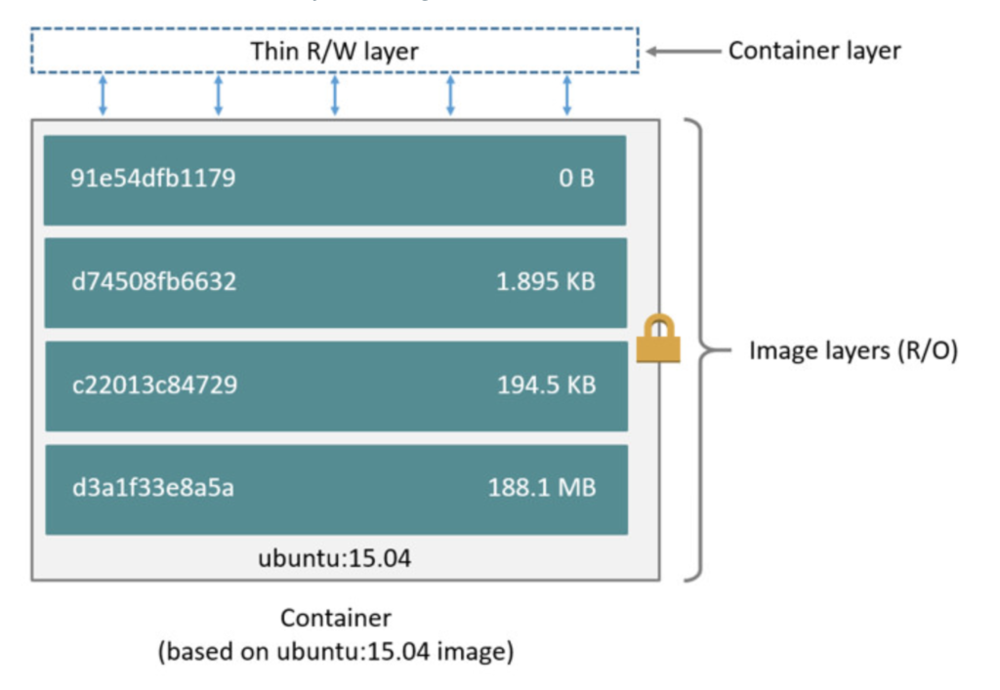

class: inverse, center, middle

# CI/CD implementálása Maven/Gradle, Jenkins/GitLab és Docker/Kubernetes eszközökkel

---

class: inverse, center, middle

# Bevezetés

---

## Continuous Delivery

* Elvek és gyakorlatok összessége
* Értékes és robosztus szoftver kiadására
* Rövid ciklusokban
* Funkcionalitás apró darabokban kerül hozzáadásra
* Bármelyik pillanatban kiadható
* Alapja: Jez Humble, Dave Farley: Continuous Delivery (Addison-Wesley, 2010)
* Technológiai és szervezeti vonatkozásai
* Daniel Bryant, Abraham Marín-Pérez: Continuous Delivery in Java (O'Reilly, 2018)

---

## Build pipeline

* Eszköze az automatizált, ismételhető, megbízható build pipeline
* Egy artifact megy végig: _single source of truth_
  * Amennyiben más megy ki teszt és éles környezetbe, lehet, hogy a hiba csak az egyik környezetben fog megjelenni
  * Így szoktak hivatkozni a verziókövető rendszerre is
* Tipikus lépései
	* Fordítás
	* Statikus kódellenőrzés
	* Csomagolás
	* Tesztesetek, lsd. teszt piramis (unit, integrációs, end-to-end)
	* Tesztlefedettség mérés
	* Nemfunkcionális követelmények tesztelése (teljesítmény és biztonsági tesztek)
	* Publikálás
	* Telepítés különböző környezetekbe, beleértve az adatbázis migrációkat is

---

## Gyors visszajelzések előnyei

* Gyors visszajelzés
	* Üzleti oldalról
	* Technológiai oldalról
* Minél koraibb visszacsatolás, annál kisebb a hibajavítás költsége
* Hibajavításkor nem nagyon régi kódhoz kell visszanyúlni
* Csökken a context switch költsége

---

## Ellenpélda

* Megbízhatatlan, körülményes telepítési folyamat
* Kiadás elodázása 
* Big bang release
* Lassú visszajelzés

---

## Microservices környezet

* Több apró alkalmazás
* Több pipeline
* Pipeline-ok közötti függőségek
* Bonyolultabb tesztelés
    * Test double használata izolált környezetben
    * Több service vezérlése integrált környezetben
* A telepítést vezérelni kell
    * Verziókezelés, API kompatibilitás
* Egységes monitorozás, naplóbegyűjtés, riasztás

---

## DevOps

* A szereplők közötti kommunikáció és együttműködés magasabb szintre emelése
* Növeli az átláthatóságot
* Automatizált és monitorozott folyamatok
* Szoftverfejlesztés teljes folyamatára: integráció, tesztelés, telepítés
* Gyors, gyakori és megbízható
* Egy része a CD
* Mechanical sympathy - a fejlesztőt érdekelje a futtató infrastruktúra

---

## Metrikák

* Mennyi idő alatt kerül ki egy kódmódosítás az élesbe
* Nyitott hibák száma
* Sikeres kiadások aránya
* Megszakított kiadások aránya

---

## Twelve-Factor Apps hatása a CD-re

https://12factor.net/

* Codebase: egyszerűbb, hogy minden egy repository-ban van 
(forráskód, szkriptek, pipeline, konfiguráció)
* Dependencies: Maven/Gradle explicit kezeli
* Config: Docker environment, vagy Spring Cloud Config/HasiCorp Vault
* Backing services: in-memory/konténer
* Build, release, run: Maven/Gradle biztosítja
* Processes: több konténer

---

## Twelve-Factor Apps hatása a CD-re

* Port binding: biztosítják a futtatókörnyezetek
* Concurrency: skálázás JVM-en belüli szálakkal és több
példánnyal (több konténer), automatizáltan tesztelendő
* Disposability: alkalmazás fejlesztéskor kell rá vigyázni
* Dev/prod parity: konténerizációval egyszerűsödik
* Logs: Naplózó keretrendszerek tudnak konzolra/fájlba írni
* Admin processes: Automatizáltan tesztelendő

---

class: inverse, center, middle

# Verziókezelés

---

## Verziókezelő

* Forráskód, erőforrás állományok, tesztesetek, konfigurációk
* Single source of truth

---

## Monorepo vagy multiple <br /> repositories

* Egyben látható, kezelhető
* Segíti a tudásmegosztást, kódújrafelhasználást,
átláthatóságot
* Egyszerűbb lehet a service-eken átívelő tesztek felépítése
* Egyszerűbb a service-eken átívelő módosítások kezelése
* Elrettentő lehet
* Túl nagy méret, feature branch
* Maven pl. nincs kellően felkészítve rá

---

## Projekt átmásolása

```shell
git clone https://github.com/Training360/javax-ci-public
xcopy /e /i javax-ci-public employees
```

---

class: inverse, center, middle

# Build

---

## Automatikus build eszközök <br /> jellemzői

* Incremental compilation
* Incremental build
* Több programozási nyelv és platform támogatása
* Dependency management, repository kezelés
* Multimodule
* Profiles (különböző artifact különböző környezetekre?)
* Bővíthetőség: plugin
* Artifact release és deploy (repo-ba)

---

## Maven vs. Gradle

https://gradle.org/maven-vs-gradle/

* Maven
  * De facto standard, szélesebb körben elterjedt
  * Nehéz testreszabni
* Gradle
  * Nagyobb flexibilitás
  * Inkrementális build, csak a megváltozott osztályokat fordítja le újra
    * Ennek megfelelően a megfelelő taskokat is képes átugorni
    * Multimodule projekteknél is működik: partial build
  * Nagyra növő multimodule projektekhez
  * Groovy DSL tömörebb, mint az XML

---

class: inverse, center, middle

# Függőségkezelés

---

class: inverse, center, middle

# Unit tesztek

---

class: inverse, center, middle

# Tesztlefedettség

---

class: inverse, center, middle


# Feature Flag

---

## Feature flag

* Main branch alapú fejlesztés
* Minden commit egy potenciális release
* Feature Flag
* Deploy vs. release
  * Attól, hogy kikerül éles környezetbe, még nem biztos, hogy használatba veheti a felhasználó
  * Elválik a szereplő, hogy ki release-elheti ki

---


class: inverse, center, middle

# Release Mavennel

---

## Release

* Egyedi verziószámot ad a buildnek
* VCS-t is meg kell taggelni

---

## Maven

* Maven Release Plugin - nagyon sok műveletet elvégzett
  * Continuous Delivery-t nem támogatja
  * [Axel Fontaine blogja](https://axelfontaine.com/blog/dead-burried.html)
* Maven Versions Plugin
* Maven támogatás: property placeholder a `<version>` tagek között

```shell
mvnw deploy scm:tag -Drevision=$BUILD_NUMBER
```

* Ahol a `BUILD_NUMBER` környezeti változót a CI rendszer adja át
* Kombinálható a semantic versioninggel (manuálisan állítandó be)

---

## Maven pom.xml

```xml
<version>${revision}</version>

<plugin>
  <artifactId>maven-scm-plugin</artifactId>
  <version>1.9.4</version>
  <configuration>
      <tag>${project.artifactId}-${project.version}</tag>
  </configuration>
</plugin>
```

---

## Gitflow Maven támogatás

* [JGit-Flow](https://bitbucket.org/atlassian/jgit-flow/src/develop/) - Gitflowt támogató Maven plugin
  * Starting a release: branch és `pom.xml` átírás
  * Finishing a release
  * Starting and finishing a hotfix
  * Starting and finishing a feature

---

class: inverse, center, middle

# Package

---

## Package

* JAR - függőségek nélkül
* Fat ("Uber") JAR - függőségekkel
  * Maven Shade Plugin
  * Maven Assembly Plugin (name conflict problémák lehetnek)
* Skinny JAR
  * SlimFast: S3-ra külön a JAR és külön a függőségek
* Megoldani konténerizációval: Spring Layered JAR
* WAR - függőségek az alkalmazásszerver részei
  * Skinny WAR - 3rd party libek külön

---

class: inverse, center, middle

# Bevezetés a Docker használatába

---

## Konténerizáció

* Teljes alkalmazás szállítása a környezetével együtt
* Analógia: szabványosítás konténerekkel a szállítmányozásban
* Lokális környezetben a háttérszolgáltatások (DB, queue, más rendszerek stb.) futtatása egyszerűbb
* Artifact: image
* Automata teszteknél is használható
* Élesbe is konténer megy

---

## Docker

* Operációs rendszer szintű virtualizáció
* Jól elkülönített környezetek, saját fájlrendszerrel és telepített szoftverekkel
* Jól meghatározott módon kommunikálhatnak egymással
* Kernelt nem tartalmaz, hanem a host Linux kernel izoláltan futtatja
   * Linux kernel cgroups és namespaces képességeire alapozva
* Kevésbé erőforrásigényes, mint a virtualizáció

---

## Docker


---

## Docker Windowson

* Docker Toolbox: VirtualBoxon futó Linuxon
* Hyper-V megoldás: LinuxKit, Linux Containers for Windows (LCOW), MobyVM
* WSL2 - Windows Subsystem for Linux - 2-es verziótól Microsoft által Windowson fordított és futtatott Linux kernel

---

## Docker felhasználási módja

* Saját fejlesztői környezetben reprodukálható erőforrások
  * Adatbázis (relációs/NoSQL), cache, kapcsolódó rendszerek <br /> (kifejezetten microservice környezetben)
* Saját fejlesztői környezettől való izoláció
* Docker image tartalmazza a teljes környezetet, függőségeket is
* Portabilitás (különböző környezeten futattható, pl. saját gép, <br /> privát vagy publikus felhő)

---

## További Docker komponensek

* Docker Hub - publikus szolgáltatás image-ek megosztására
* Docker Compose - több konténer egyidejű kezelése
* Docker Swarm - natív cluster támogatás
* Docker Machine - távoli Docker környezetek üzemeltetéséhez

---

## Docker fogalmak


---

## Docker konténerek

```shell
docker version
docker run hello-world
docker run -p 8080:80 nginx
docker run -d -p 8080:80 nginx
docker ps
docker stop 517e15770697
docker run -d -p 8080:80 --name my-nginx nginx
docker stop my-nginx
docker ps -a
docker start my-nginx
docker logs -f my-nginx
docker stop my-nginx
docker rm my-nginx
```

Használható az azonosító első három karaktere is

---

## Bejelentkezés

```shell
docker exec -it my-nginx bash
```

---

## Műveletek image-ekkel

```shell
docker images
docker rmi nginx
```

---

## Prune

* Takarítás
* https://docs.docker.com/config/pruning/

```shell
docker system prune
```

---

## Volumes

* bind mount helyett
* Docker parancsokkal kezelhető
* Linux és Windows alatt is működik
* Meg lehet osztani konténerek között
* Egyszerűbben backupolható és visszaállítható
* További lehetőség: lokális vagy remote tárolás, titkosítás, stb.
* Tartalmuk előre feltölthető
* Mac-en és Windowson gyorsabb, mint a bind

```shell
docker volume ls
```

Helye Windows esetén: `\\wsl$\docker-desktop-data\version-pack-data\community\docker\volumes`

---

class: inverse, center, middle

# Integrációs tesztek valós adatbázison

---

## Integrációs tesztek <br /> valós adatbázison

```shell
docker run 
  -d
  -e MYSQL_DATABASE=employees 
  -e MYSQL_USER=employees 
  -e MYSQL_PASSWORD=employees 
  -e MYSQL_ALLOW_EMPTY_PASSWORD=yes
  -p 3306:3306 
  --name employees-mariadb 
  mariadb
```

---

## Integrációs teszteknek <br /> paraméterek átadása Gradle-ből

```groovy
systemProperty 'spring.datasource.url', findProperty('spring.datasource.url') ?: "jdbc:h2:mem:db;DB_CLOSE_DELAY=-1"
systemProperty 'spring.datasource.username', findProperty('spring.datasource.username') ?: "su"
systemProperty 'spring.datasource.password', findProperty('spring.datasource.password') ?: "su"
```

```shell
gradlew 
  -Pspring.datasource.url=jdbc:mariadb://localhost/employees 
  -Pspring.datasource.username=employees  
  -Pspring.datasource.password=employees 
  clean integrationTest
```

---

class: inverse, center, middle

# Java alkalmazások Dockerrel

---

## Saját image összeállítása

`Dockerfile` fájl tartalma:

```docker
FROM adoptopenjdk:11-jre-hotspot
WORKDIR /opt/app
COPY target/*.jar employees.jar
CMD ["java", "-jar", "employees.jar"]
```

Parancsok:

```shell
docker build -t employees .
docker run 
  -d 
  --name employees
  -p 8080:8080 
  employees
```

---

## Valós adatbázissal

```shell
docker network create employees-net

docker run 
  -d
  -e MYSQL_DATABASE=employees 
  -e MYSQL_USER=employees 
  -e MYSQL_PASSWORD=employees 
  -e MYSQL_ALLOW_EMPTY_PASSWORD=yes
  -p 3306:3306 
  --network employees-net
  --name employees-app-mariadb 
  mariadb

docker run 
  -d 
  -e SPRING_DATASOURCE_URL=jdbc:mariadb://employees-app-mariadb/employees
  -e SPRING_DATASOURCE_USERNAME=employees
  -e SPRING_DATASOURCE_PASSWORD=employees
  --network employees-net
  --name employees
  -p 8080:8080 
  employees
```
---

class: inverse, center, middle

# Docker konténer futtatása Gradle-ből

---

## Gradle Docker plugin

https://github.com/bmuschko/gradle-docker-plugin
https://bmuschko.github.io/gradle-docker-plugin/


---

## Docker konténer futtatása <br /> Gradle-ből

```groovy
plugins {
  id 'com.palantir.docker-run' version '0.26.0'
}

dockerRun {
    def url = findProperty('spring.datasource.url') ?: 'jdbc:h2:mem:db;DB_CLOSE_DELAY=-1'
    def username = findProperty('spring.datasource.username') ?: 'sa'
    def password = findProperty('spring.datasource.password') ?: 'sa'

    name 'my-employees'
    image 'employees'
    ports '8080:8080'
    daemonize true
    env 'spring.datasource.url': url, 'spring.datasource.username': username, 'spring.datasource.password': password
    arguments '--network=employees-net', '-P'
}
```

---

## Docker konténer futtatása <br /> Gradle-ből

```shell
gradlew 
  -Pspring.datasource.url=jdbc:mariadb://employees-mariadb/employees 
  -Pspring.datasource.username=employees  
  -Pspring.datasource.password=employees 
  dockerRun 
```

---

class: inverse, center, middle

# Docker layers

---

## Layers



`docker image inspect employees`

---

## Legjobb gyakorlat

* Külön változó részeket külön layerbe tenni
* Operációs rendszer, JDK, libraries, alkalmazás saját fejlesztésű része külön <br /> layerbe kerüljön

---

## Manuálisan

* Jar fájlt ki kell csomagolni, úgy is futtatható
  * `BOOT-INF/lib` - függőségek
  * `META-INF` - leíró állományok
  * `BOOT-INF/classes` - alkalmazás saját fájljai
  
```shell
java -cp BOOT-INF\classes;BOOT-INF\lib\* training.employees.EmployeesApplication
```  

---

## Dockerfile

* [Multi-stage build](https://docs.docker.com/develop/develop-images/multistage-build/)

`Dockerfile.layered` tartalma:
  
```docker
FROM adoptopenjdk:14-jdk-hotspot as builder
WORKDIR app
COPY target/employees-0.0.1-SNAPSHOT.jar employees.jar
RUN jar xvf employees.jar

FROM adoptopenjdk:14-jre-hotspot
WORKDIR app
COPY --from=builder app/BOOT-INF/lib lib
COPY --from=builder app/META-INF META-INF
COPY --from=builder app/BOOT-INF/classes classes

ENTRYPOINT ["java", "-cp", "classes:lib/*", \
            	"training.employees.EmployeesApplication"]
```

---

## Build fájl átadása

```shell
docker build --file Dockerfile.layered  .  
```

---

class: inverse, center, middle

# Build Docker konténerben

---

## Build Docker konténerben

`Dockerfile.localebuild` tartalma:

```dockerfile
FROM adoptopenjdk:11-jdk-hotspot as builder
WORKDIR app
COPY . .
RUN ./gradlew test assemble

FROM adoptopenjdk:11-jre-hotspot
WORKDIR app
COPY --from=builder app/build/libs/*.jar ./employees.jar
ENTRYPOINT ["java", "-jar", "employees.jar"]
```

---

## Gradle image-ből kiindulva

```dockerfile
FROM gradle:7.0.2-jdk8 as builder
WORKDIR app
COPY . .
RUN gradle test assemble

FROM adoptopenjdk:11-jre-hotspot
WORKDIR app
COPY --from=builder /home/gradle/app/build/libs/*.jar ./employees.jar
ENTRYPOINT ["java", "-jar", "employees.jar"]
```

---

## Build

```shell
docker build --file Dockerfile.localebuild -t employees .
```

* Lassú, mert minden esetben letölti a Gradle-t és a függőségeket
* A Docker `build` parancsnak nem lehet átadni volume-ot
* Ha még át is lehetne: _You typically get this error when trying to share the Gradle cache amongst multiple Gradle processes that run on different hosts. _
  * https://stackoverflow.com/questions/54445467/could-not-create-service-of-type-filehasher-using-gradleuserhomescopeservices-cr
* Megoldás: átmásolni valahonnan
* Pl. cache-elni külön image-ben
  * https://stackoverflow.com/questions/58593661/slow-gradle-build-in-docker-caching-gradle-build


Hasznos Docker kapcsolók: `--no-cache --progress=plain`

---

## Cache image

`Dockerfile.localebuild-cache` tartalma:

```dockerfile
FROM adoptopenjdk:11-jdk-hotspot as cache
WORKDIR app
COPY gradle ./gradle
COPY settings.gradle .
COPY build.gradle .
COPY gradlew .
RUN chmod +x gradlew
RUN ./gradlew build

FROM adoptopenjdk:11-jdk-hotspot as builder
WORKDIR app
COPY --from=cache /root/.gradle /root/.gradle
COPY . .
RUN ./gradlew test assemble
```

---

class: inverse, center, middle

# E2E tesztelés Docker konténerekben

---

## E2E tesztelés <br /> Docker konténerekben

* Postman: Create collection, Create request, Create test
* [Newman](https://learning.postman.com/docs/running-collections/using-newman-cli/command-line-integration-with-newman/)
  * [Docker image](https://hub.docker.com/r/postman/newman)

---

## Wait-for-it

[Wait-for-it](https://github.com/vishnubob/wait-for-it)

[Dockerize](https://github.com/jwilder/dockerize)

```shell
git update-index --chmod=+x wait-for-it.sh 
```
---

## E2E tesztek futtatása

```shell
docker run 
  -t 
  -v "/C/training/employees/integration-tests/postman:/etc/newman" 
  -v "/C/training/employees/integration-tests/wait:/opt/wait" 
  --entrypoint "" 
  postman/newman:5-ubuntu 
  /opt/wait/wait-for-it.sh -t 120 "http://employees-it-app:8080 newman run --environment=test.postman_environment.json employees.postman_collection.json
```

* *Windows alatt csak abszolút elérési útvonallal működik*
  * Docker compose esetén már megy a relatív elérési út

---

## Docker compose

.small-code-10[
```docker
version: '3'

services:
  employees-it-mariadb:
    image: mariadb
    expose:
      - 3306
    environment:
      MYSQL_DATABASE: employees
      MYSQL_ALLOW_EMPTY_PASSWORD: 'yes' # aposztrófok nélkül boolean true-ként értelmezi
      MYSQL_USER: employees
      MYSQL_PASSWORD: employees

  employees-it-app:
    image: employees
    depends_on:
      - employees-it-mariadb
    environment:
      SPRING_DATASOURCE_URL: 'jdbc:mariadb://employees-it-mariadb:3306/employees'
    volumes:
    - ./wait:/opt/wait
    entrypoint: ["/opt/wait/wait-for-it.sh", "-t", "120", "employees-it-mariadb:3306", "--", "java", "-jar", "employees.jar"]
    expose:
      - 8080

  employees-it-newman:
    image: postman/newman:5-ubuntu
    volumes:
    - ./postman:/etc/newman
    - ./wait:/opt/wait
    entrypoint: ["/opt/wait/wait-for-it.sh", "-t", "30", "employees-it-app:8080", "--", "newman", "run", 'employees.postman_collection.json', '-e', 'test.postman_environment.json']
    depends_on:
      - employees-it-app
```
]

---

## Docker compose futtatás

```shell
docker-compose up --abort-on-container-exit
```

* a `--abort-on-container-exit` kapcsoló hatására leállítja az összeset, ha egy is leáll

---

class: inverse, center, middle

# Jenkins

---

## Jenkins

* Docker in Docker
    * [Using Docker-in-Docker for your CI or testing environment? Think twice.](http://jpetazzo.github.io/2015/09/03/do-not-use-docker-in-docker-for-ci/)

---

## Jenkins

https://github.com/jenkinsci/docker/blob/master/README.md

* Saját image a Docker client miatt

```shell
docker build -f Dockerfile.jenkins -t employees-jenkins .
docker network create jenkins
docker run 
  --detach 
  --network jenkins 
  --volume jenkins-data:/var/jenkins_home 
  --volume /var/run/docker.sock:/var/run/docker.sock 
  --publish 8090:8080 
  --name employees-jenkins 
  employees-jenkins
```

---

## Docker in Docker

```
Got permission denied while trying to connect to the Docker daemon socket 
at unix:///var/run/docker.sock: 
Get http://%2Fvar%2Frun%2Fdocker.sock/v1.24/containers/adoptopenjdk:11-jdk-hotspot/json: 
dial unix /var/run/docker.sock: connect: permission denied
```

```shell
chmod 777 /var/run/docker.sock
```

```shell
docker exec --user root -it employees-jenkins chmod 777 /var/run/docker.sock
```

---

## Nyelv beállítása

* Locale plugin
* Manage / Configure System / Locale
  * Default Language: `en`
  * Ignore browser preference and force this language to all users: checked

---

## Pipeline

https://www.jenkins.io/doc/book/pipeline/docker/

---

## BlueOcean

https://www.jenkins.io/projects/blueocean/

---

class: inverse, center, middle

# Új job

---

## Job létrehozása

* Új Item
* Projektnév megadása, pl. `employees`
* Pipeline
* Pipeline/Definition Pipeline script from SCM
* Git
* Repository URL kitöltése, pl. `https://github.com/Training360/employees`

---

## Futtatás, újrafuttatás

Újrafuttatás `clean`-nel, `Pipeline` szerkesztése

---

## Build number

```groovy
def buildNumber = findProperty('buildNumber')
version = '0.0.1-' + buildNumber
```

```groovy
stage('Build') { 
            steps {
                sh './gradlew -PbuildNumber=${BUILD_NUMBER} test assemble'
            }
        }
```
---

class: inverse, center, middle

# SonarQube

---

## SonarQube

```shell
docker run --name employees-sonarqube --detach 
  --network jenkins 
  --publish 9000:9000 
  sonarqube:lts
```

`admin`/`admin`

https://hub.docker.com/_/sonarqube

---

## SonarLint

* SonarLint és SonarQube integráció

---

## Quality Profiles

* No import/export

---

## Quality Gates

* Aszinkron adja vissza az elemzés eredményét

https://docs.sonarqube.org/latest/analysis/ci-integration-overview/

---

## Maven bevárás

```
mvnw sonar:sonar -Dsonar.qualitygate.wait=true
```

---

class: inverse, center, middle

# Jenkins és SonarQube integráció

---

## SonarQube Gradle task meghívása

```groovy
stage('SonarQube') { 
    steps {
        sh './gradlew sonarqube'
    }
}
```

* Beégetett felhasználónév/jelszó párossal

---

## Credentials

* _Manage Jenkins / Credentials / (global)_
* _Add credential_
* _Kind_: _Username with password_
* _ID_: `sonar-credentials`

---

## Pipeline

```groovy
environment {
   SONAR_CREDENTIALS = credentials('sonar-credentials')
}
```

```groovy
stage('SonarQube') { 
    steps {
        sh './gradlew -Psonar.login=${SONAR_CREDENTIALS_USR} -Psonar.password=${SONAR_CREDENTIALS_PSW}'
    }
}
```

* Vigyázat: _Replay_ nem az új `Jenkinsfile` fájlt használja
* Vigyázat: `echo ${SONAR_CREDENTIALS_USR}` nem működik
* Helyette `sh echo ${SONAR_CREDENTIALS_USR} - ${SONAR_CREDENTIALS_PSW}`, de a jelszó így is csillagozva

---

class: inverse, center, middle

# ArchUnit

---

## ArchUnit

`build.gradle` fájlban

```groovy
testImplementation 'com.tngtech.archunit:archunit-junit5:0.17.0'
```

---

## ArchUnit teszteset

```java
@AnalyzeClasses(packages = "employees")
public class ArchUnitTest {

    @ArchTest
    public static final ArchRule layeredRule = layeredArchitecture()
                .layer("Controller").definedBy("..controller..")
                .layer("Service").definedBy("..service..")
                .layer("Persistence").definedBy("..repository..")

                .whereLayer("Controller").mayNotBeAccessedByAnyLayer()
                .whereLayer("Service").mayOnlyBeAccessedByLayers("Controller")
                .whereLayer("Persistence").mayOnlyBeAccessedByLayers("Service");
}
```

---

## ArchUnit szabályok

https://www.archunit.org/userguide/html/000_Index.html

---

class: inverse, center, middle

# Nexus

---

## Nexus elindítása

```shell
docker run --name nexus --detach
  --network jenkins
  --publish 8091:8081
*  --publish 8092:8082
  --volume nexus-data:/nexus-data
  sonatype/nexus3
```

```shell
docker exec -it nexus cat /nexus-data/admin.password
```


---

## Nexus proxy-ként (globális)

A `~/.gradle/init.d/mirror.gradle` fájl tartalma:

```groovy
allprojects {
  ext.RepoConfigurator = {
    maven {
      url = uri('http://localhost:8091/repository/maven-public/') 
      allowInsecureProtocol true
    }
  }
  buildscript.repositories RepoConfigurator
  repositories RepoConfigurator
}
```

* Gradle 7-től kezdődően https-en kéne, `allowInsecureProtocol` konfig kikapcsolja ennek ellenőrzését

---

## Nexus proxy-ként (lokális)

```groovy
repositories {
   maven {
    url "http://localhost:8091/repository/maven-public/"
    allowInsecureProtocol true
  }
}
```

---

## Deploy to Nexus 

.small-code-14[
```groovy
plugins {
    id 'maven-publish'
}

publishing {
    publications {
        bootJava(MavenPublication) {
            artifact bootJar
        }
    }
    repositories {
        maven {
            def nexusUrl = findProperty('nexusUrl') ?: 'http://localhost:8091'
            def releasesRepoUrl = nexusUrl + "/repository/maven-releases/"
            def snapshotsRepoUrl = nexusUrl + "/repository/maven-snapshots/"
            url = version.endsWith('SNAPSHOT') ? snapshotsRepoUrl : releasesRepoUrl
            credentials {
                username findProperty('nexusUsername') ?: 'admin'
                password findProperty('nexusPassword') ?: 'admin'
            }
            allowInsecureProtocol true
        }
    }
}
```
]

```shell
gradlew bootJar publish
```

---

## Jenkinsből Nexus publish

https://www.jenkins.io/doc/book/pipeline/docker/

```groovy
stage('Publish') {
  steps {
    sh './gradlew -PbuildNumber=${BUILD_NUMBER} -PnexusUrl=http://nexus:8081 -PnexusUsername=admin -PnexusPassword=admin publish'
  }
}
```


---

## Deploy Docker image

* Create Docker hosted repository (port `8082`)
* Adminisztrációs felületen: _Nexus Security / Realms_ tabon: _Docker Bearer Token Realm_ hozzáadása

```shell
docker tag employees localhost:8092/employees
docker login localhost:8092
docker push localhost:8092/employees
```

---

class: inverse, center, middle

# Üzemeltetési platformok

---

## Platform típusok

* Hagyományos platform
* Cloud
	* Osztályozás hozzáférés szerint
		* Private
		* Public
		* Hybrid
	* Osztályozás funkcionalitás szerint
		* IaaS
		* PaaS
* Konténerek (Docker)
* Orchestration (Kubernetes)
* FaaS
	
---

## Hagyományos platform

* Saját platform, operációs rendszer,
	alkalmazásszerver, adatbázis, middleware
* Nincs standard CD megoldás
* Gyakran a környezet nincs lekódolva
* Gyakran nagy az üzemeltetés és a fejlesztés között a távolság

---

## Cloud

* Különböző típusú komponensek (compute, storage, network, backend services)
* Sok esetben van CD service is
* Felkészülni, hogy valamelyik komponens meghibásodik
* Immutable infrastructure
* Tipikusan programozható (Infrastructure as code)
* Java kötöttségek PaaS esetén (pl. verziószám, paraméterezés)

---

## Konténerek

* Konténerizáció az operációs rendszer szinten megvalósítható virtualizáció vagy process izoláció
* Docker ennek egy implementációja (kiegészítve felhasználóbarát feature-ökkel és repository kezeléssel)
* Hátránya, hogy egy új, akár teljes embert kívánó technológia, ami gyorsan változik
* Jobban passzol az immutable infrastructure-höz
* Java tapasztalatok
  * Java 9 előtt a host gép processzormagok számát adta vissza
  * A host `/dev/random` eszközt használja több alkalmazás, és ez lehet szűk keresztmetszet

---

## CD konténerizált környezetben

* CD pipeline image-et állít elő, és ezt kell végigvinni az élesig
* Saját container platform esetén Infrastructure as code (Terraform, Ansible), minden legyen verziókezelőben
* Alkalmazás konfigurációk, és akár build containerek konfigurációja is verziókezelőben
* Automatizáld a tanulási folyamataid eredményeid, előzd meg a hibáid újra előfordulását: load testing, security testing, chaos/resilience testing

---

## Orchestration

* Tipikusan Docker Swarm és Kubernetes
* Több konténer kezelése
* Container infrastructure as a service (CIaaS)
* Immutable infrastructure - nem egy konténer módosítása, hanem új konténer üzembe állítása
* Deklaratív, azaz az elvárt eredményt kell leírni
* Hátránya: egy újabb megtanulni és követendő technológia
* Javaslat: sose építsd saját Kubernetes clustert, inkább használj egyet egy szolgáltatótól! 

---

## Immutable és deklaratív <br /> infrastruktúra

* Jól dokumentált
* A kóddal együtt verziókezelhető
* Támogatja a self-healinget, azaz, ha leáll egy node, akkor az orcestration tudja, hogyan kell újat létrehoznia

---

## Kubernetes alapfogalmak

* _Pod_
  * Összetartozó konténerek egy csoportja (alkalmazás és pl. adatbázis, naplózás, monitorozás)
  * Megosztott fájlrendszer és hálózat
* _Services_
  * Load balancing
  * Naming
  * Discovery
* _Deployments_
* A három össze van kötve címkékkel az azonosíthatóság, együtt kezelés kedvéért

---

## FaaS

* Klasszikus alkalmazás felépítésére nem alkalmas,
 szinkron hívásokkal
* Event Driven Architecture
* Reactive
* Az infrastuktúrát a szolgáltató adja, csak a kóddal kell foglalkozni
* Java kötöttségek (módosított JRE-ben, kontrollált fájl és hálózatelérés, time limit)
* Érdemes monitorozni a hívások számát, erőforrásszükségletet
* Nem egyszerű tanulni
* Tesztelése sem egyszerű
