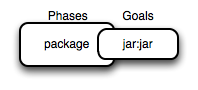

class: inverse, center, middle

.training360-logo[]

# Apache Maven
software project management and comprehension tool

---

## Források
* [Sonatype könyvek](http://www.sonatype.com/resources/books)
	* Maven by Example
	* Maven: The Complete Reference
	* Repository Management with Nexus
* http://maven.apache.org/

---

## Maven ismérvek

*	Build tool kontra project management tool
*	Build tool: preprocess, compile, package, test, distribution
*	Project management tool: függőségek, riportok, site generálás, kommunikáció megkönnyítése
*	Convention over configuration
*	Common interface for project build
	* Mindenki ismeri és használja
	* Akár egy nyílt forráskódú fejlesztésbe is könnyebb beszállni
* Újrafelhasználhatóság: Maven pluginek
* Platform és IDE függetlenség

---

## Maven alapfogalmak

* Artifact
* Dependency
*	Repository
	* Lokális
	* Távoli
	* Belső működéséhez is


---

## Ant kontra Maven

*	Ant: több konfiguráció, Maven: kevesebb konfigurációval több funkció
*	Ant: procedúrális, Maven: deklaratív
*	Ant: nincs konvenció, Maven: convention over configuration
*	Ant: nincs életciklus, Maven: életciklus
*	Ant: függőség kezelés csak külön eszköz: Ivy
*	Ant futtatható a Mavenből, Maven futtatható Antból

---

class: inverse, center, middle

.training360-logo[]

# Telepítés

---

## Telepítés

*	Java JDK
*	Zip/tar.gz
*	`PATH` környezeti változó
*	`M2_HOME` környezeti változó
*	Személyes beállítások
		* `~/.m2/settings.xml` állomány
		* `~/.m2/repository` könyvtár		
* Ellenőrizni az `mvn -version` paranccsal

---

## `settings.xml` állomány

* Lokális repository helye
* Proxy szerver
* Stb.
* `mvn help:effective-settings`

---

## Lokális repository helye

```xml
<settings xmlns="http://maven.apache.org/SETTINGS/1.0.0"
  xmlns:xsi="http://www.w3.org/2001/XMLSchema-instance"
  xsi:schemaLocation="http://maven.apache.org/SETTINGS/1.0.0
                      https://maven.apache.org/xsd/settings-1.0.0.xsd">
  <localRepository>${user.home}/.m2/repository</localRepository>
</settings>
```

---

## Könyvtárstruktúra
*	`bin`: `mvn`, `mvnDebug` (Windows esetén `.bat` kiterjesztésű állományok)
*	`boot`: `plexus-classworlds-2.5.2.jar` – Class Loader betöltése
*	`conf`: `logging`, `settings.xml`
*	`lib`: modularizált
	* [Apache Maven Artifact Resolver](https://maven.apache.org/resolver/index.html) – Working with repositories and dependency resolution
	* [Eclipse Sisu](https://www.eclipse.org/sisu/) – IoC konténer
	* Plexus - Maven utility-k
	* [Wagon](https://maven.apache.org/wagon/index.html) – transport abstraction

---

class: inverse, center, middle

.training360-logo[]

# Egyszerű projekt

---

## Egyszerű projekt

*	Archetype: minta, prototípus, váz

```
mvn archetype:generate
	-DgroupId=com.training360
	-DartifactId=simple
	-DarchetypeArtifactId=maven-archetype-quickstart
	-DinteractiveMode=false
```

---

## POM

POM: Project Object Model

```xml
<project xmlns="http://maven.apache.org/POM/4.0.0"
	xmlns:xsi="http://www.w3.org/2001/XMLSchema-instance"
	xsi:schemaLocation="http://maven.apache.org/POM/4.0.0 http://maven.apache.org/maven-v4_0_0.xsd">
	<modelVersion>4.0.0</modelVersion>
	<groupId>com.training360</groupId>
	<artifactId>simple</artifactId>
	<version>1.0-SNAPSHOT</version>
</project>
```

---

## Kötelező project elemek

*	Maven koordináták - GAV (`groupId`, `artifactId`, `version`, `packaging`, `classifier`)
*	Version:
	* `<major version>.<minor version>.<incremental version>-<qualifier>`
	* Semantic versioning
	* Ha ebben a formában kerül megadásra, akkor működik az összehasonlítás, range megadás
	* Ellenkező esetben String comparison

---

## Packaging

* Default

```xml
<packaging>jar</packaging>
```

* JAR állomány neve

```xml
<finalName>simple</finalName>
```

---

## Könyvtárszerkezet

* `src`
* `src/main`
* `src/main/java`

---

## Parancsok

Említésszinten:

* `mvn clean`
* `mvn package`
* `mvn clean package`

---

## Build folyamat

* `target` könyvtár
* Fordítás
* Teszt esetek futtatása
* Csomagolás

---

## Függőség

```xml
<dependencies>
	<dependency>
		<groupId>junit</groupId>
		<artifactId>junit</artifactId>
		<version>3.8.1</version>
		<scope>test</scope>
	</dependency>
</dependencies>
```

---

## Függőség kezelése

* Megjelenik a locale repository-ban
* Classpath
* http://search.maven.org/

---

## Finomhangolás - karakterkódolás

```
[WARNING] File encoding has not been set, using platform encoding Cp1250,
	i.e. build is platform dependent!
```

```xml
<properties>
	<project.build.sourceEncoding>UTF-8</project.build.sourceEncoding>
</properties>
```

---

## Finomhangolás - Java verzió

```xml
<properties>
		<maven.compiler.source>1.8</maven.compiler.source>
		<maven.compiler.target>1.8</maven.compiler.target>
</properties>
```

---

## Resource-ok

* Maven resources plugin
* `src/main/resources`

```xml
<build>
	<resource>
		<filtering>true</filtering>
	</resource>
</build>
```

Bináris állományokat elronthatja!

---

## Unit tesztek

* `test` scope függőségek
* Könyvtárak
	* `src/test`
	* `src/test/java`
	* `src/test/resources`
* Surefire plugin (JUnit, TestNG)
* `mvn package -DskipTests`

---

## Maven exec plugin

*	`mvn exec:java –Dexec.mainClass=training360.simple.Main -Dexec.args="1234"`

---

## Futtatható JAR

```xml
<plugin>
		<groupId>org.apache.maven.plugins</groupId>
		<artifactId>maven-jar-plugin</artifactId>
		<version>2.4</version>
		<configuration>
				<archive>
						<manifest>
								<mainClass>jtechlog.classnames.ClassNamesMain</mainClass>
								<addClasspath>true</addClasspath>
						</manifest>
				</archive>
		</configuration>
</plugin>
```

---

## Memória és futtatás debug módban

*	Memória: `MAVEN_OPTS` környezeti változó
* Pl. Linuxon

```
export MAVEN_OPTS="-Xmx1024m -Xms512m"
```

* `-X`, `--debug`

```
mvn -X package
```

---

## További project elemek

*	Függőségek
*	Project öröklődés
*	Multi-module project
*	Property-k
*	Resource-ok
*	Plugin customization
*	Reporting
*	Distribution management
*	Profile

---

## Projekt információk

* Licence-ek
* Szervezet
* Fejlesztők
* Résztvevők

---

## Környezeti információk

* Issue management
* CI
* Levelezési listák
* Verziókezelő
* Repository

---

## Pluginek és életciklus

*	Goal: egyedi funkció, önmagában is futtatható
*	Plugin: összetartozó goalok
*	Property-k: default értékek, convention over configuration
*	Lifecycle – Phases – Goals
*	Build lifecycle (default)
*	Site lifecycle
*	Clean


---

## Help describe

* `help:describe` (groupId és artifactId megadandó)
*	Pl.:
	* `mvn help:describe -Dplugin=org.apache.maven.plugins:maven-help-plugin`
	* `mvn help:describe -Dplugin=org.apache.maven.plugins:maven-help-plugin -Dfull`
* Tipikusan property-kkel konfigurálhatóak, átadhatóak `-D` kapcsolóval, vagy
	konfigurálhatóak a `<plugins>` tagen belül

---

## Plugin verziószám

* Super POM-ban definiálva, Maven verzióhoz kötve
* Javasolt mindig definiálni a plugin verziószámot

---

## Plugin elnevezési konvenció

* Ha csak nevet adunk meg
	* groupId: `org.apache.maven.plugins`, `org.codehouse.mojo`
	* artifactId: `name-maven-plugin`, `maven-name-plugin`

---

## Plugin goal fázishoz kötése (triggering)



* Packaging alapján változhat
* https://maven.apache.org/guides/introduction/introduction-to-the-lifecycle.html

---

## Fázisok


---

## Repository-k

*	Local Maven Repositories (cache)
*	Remote Repositories
	* Public Repositories, Central repository
	* Internal Repositories (cache, proxy)
*	Snapshotok és release-ek megkülönböztetése

---

## Local repository

* `mvn install`
* 3rd party library a local repository-ba

```
mvn install:install-file
	-Dfile=ojdbc6-11.2.0.1.0.jar
	-DgroupId=com.oracle
	-DartifactId=ojdbc6
	-Dversion=11.2.0.1.0
	-Dpackaging=jar
	-DgeneratePom=true
```

---

## Public repositories

* Public Repositories, Central repository
	* `mvn help:effective-pom`
	* https://repo1.maven.org/maven2/
	*	http://search.maven.org

---

## Internal repository

* cache, proxy
* hosted
*	Saját artifactok
* 3rd party library installálása GUI-n

---

## Repository struktúra

`/<groupId>/<artifactId>/<version>/<artifactId>-<version>.<packaging>`

---

## Függőségek

*	Tranzitív függőségek – transitive dependencies
*	http://maven.apache.org/guides/introduction/introduction-to-dependency-mechanism.html
*	Ütközések feloldása – conflict resolution
	*	Nearest definition
	* Azonos szinten különböző verziók - első deklaráció

---

## Függőségek kezelése

*	Default működés felülbírálása
	* scope: compile, provided, runtime, test, system (mint a provided, csak meg kell adni a rendszerben a JAR fájl helyét), import
	* exclude
*	`mvn dependency:resolve`
*	`mvn dependency:tree`
*	Optional dependencies
*	Version ranges

---

## SNAPSHOT és fix verziók

* Fix verzió: kiadott, az artifact sosem változhat, korlátlanul cache-elhető
* SNAPSHOT verzió: folyamatos fejlesztés alatt van, tipikusan saját fejlesztésű library vagy modul
* Install esetén a `SNAPSHOT` szót kicseréli UTC dátumra és időre
* Lokális repository-ból mindig a legfrissebbet teszi a CLASSPATH-ra
* 24 óránként ellenőrzi a remote repository-ból, hogy van-e frissebb
* `-o`, `--offline` kapcsolóval nem végez ellenőrzést
* `-U`, `--update-snapshots` kapcsolóval azonnal ellenőrzést végez

---

## Maven versions plugin

* Plugin verziókkal kapcsolatos lekérdezésekre és módosításokra
* `versions:display-dependency-updates` mely függőségből van újabb verzió
* `versions:set` verzió beállítására, a gyermekek parent projekt verziószámát is tudja növelni
	* `pom.xml.versionsBackup` állományokat készít
	* `versions:commit` és `versions:revert` goalokkal kezelhető
* Plugin, property, parent, version ranges, snapshot kezelés

---

## JAR függőségekkel egybecsomagolva

```xml
<plugin>
	<groupId>org.apache.maven.plugins</groupId>
	<artifactId>maven-assembly-plugin</artifactId>
	<version>2.4</version>
	<configuration>
		<archive>
			<manifest>
				<mainClass>jtechlog.classnames.ClassNamesMain</mainClass>
			</manifest>
		</archive>
		<descriptorRefs>
			<descriptorRef>jar-with-dependencies</descriptorRef>
		</descriptorRefs>
	</configuration>
</plugin>
```

`mvn clean package assembly:single`

---

## Maven assembly plugin fázishoz kapcsolva

```xml
<executions>
		<execution>
				<id>attach-with-dependencies</id>
				<phase>package</phase>
				<goals>
						<goal>single</goal>
				</goals>
		</execution>
</executions>
```

---

class: inverse, center, middle

.training360-logo[]

# Egyszerű webes projekt

---

## Csomagolás

```xml
<packaging>war</packaging>
```

---

## Függőségek

```xml
<dependency>
		<groupId>javax.servlet</groupId>
		<artifactId>javax.servlet-api</artifactId>
		<version>3.0.1</version>
		<scope>provided</scope>
</dependency>

<dependency>
		<groupId>javax.servlet</groupId>
		<artifactId>jstl</artifactId>
		<version>1.2</version>
</dependency>
```

---

## Nem kell `web.xml`

```xml
<plugin>
		<groupId>org.apache.maven.plugins</groupId>
		<artifactId>maven-war-plugin</artifactId>
		<version>2.4</version>
		<configuration>
				<failOnMissingWebXml>false</failOnMissingWebXml>
		</configuration>
</plugin>
```

---

## Konténer - Jetty

```xml
<plugin>
		<groupId>org.eclipse.jetty</groupId>
		<artifactId>jetty-maven-plugin</artifactId>
		<version>9.2.15.v20160210</version>
</plugin>
```

---

## Futtatás

* `mvn clean package jetty:run`

---

class: inverse, center, middle

.training360-logo[]

# Több modulos projektek

---

## Szülő-gyermek projekt

* Öröklődés
* `<parent>` tag, megadandó GAV
* `<relativePath>`

---

## Effective POM

*	Project POM
*	Parent POM
*	Super POM in Maven (`lib/maven-model-builder-3.5.2.jar:/org/apache/maven/model/pom-4.0.0.xml`)
* `help:effective-pom`

---

## Többmodulos projekt

* Ugyanaz a művelet több projekten
* `<modules>` és `<module>` tag
* Reactor
* Belső függőségek feloldása
* Sorrend megtartása
	* Ha van nem lefuttatott függősége, hátrébb kerül
	* Gyakran elbukó projekteket érdemes előrébb sorolni

---

## Párhuzamos futtatás

* Több(magos) processzor esetén sebességnövekedés
* Modulok párhuzamos buildelése
* Logokat összekeveri
* Egymástól függő projekteket nem buildel párhuzamosan
* `-T 4` Négy szálon
* `-T 1C` Egy szálat futtat CPU magonként

---

## Prototype projekt

* Nem az alkalmazás moduloknak megfelelő szülő projekt
* Pl. réteg (tier) alapú felbontás

---

## Build vezérlése parancssori paraméterekkel

* `-N`, `--non-recursive` - almodulokat nem veszi figyelembe
* `-rf`, `--resume-from` - folytatás az adott almodultól
* `-pl`, `--projects` - paraméterként átadott projektek (vesszővel elválasztva)
* `-am`, `--also-make` - azokat is, melyektől függ
* `-amd`, `--also-make-dependents` - melyek a `-pl` kapcsolónak paraméterül megadott projektektől függenek

---

## Build csak az adott modulon

* Projekt feloldása a locale repository-ból

---

class: inverse, center, middle

.training360-logo[]

# POM optimalizálás

---

## Függőségek

*	Új felvitele (ha csak tranzitív függőségként van benn, de használunk)
*	Eltávolítás, ha nem használjuk, `<exclusions>`, `<exclusion>` tagek használata
* `mvn dependency:analyze`
*	Szülőbe verzió kiemelés
*	Property-k használata

---

## Dependency management

* Verziószámok definiálására
*	`<dependencyManagement>` tag
*	`<pluginManagement>` tag
*	BOM (Bill of materials): `pom` típusút lehet `import` scope-pal felvenni,
	átemeli a `<dependencyManagement>` részt

---

class: inverse, center, middle

.training360-logo[]

# Build profiles

---

## Build profiles

*	Build környezetek
*	Build properties
	* Non portable
	* Environment
	* In-house
	* Wide (universal)

---

## Build profile használata

*	Profile activation
	* Környezetfüggő (operációs rendszer, JDK)
	* Fájl megléte
	* Property alapján
	* Explicit módon a `-P` kapcsolóval
*	Protected secrets
*	Platform classifiers
* `mvn help:active-profiles`

---

## Profile-ok definiálásának helye

* `pom.xml`
* szülő `pom.xml` állományok egyike
* `settings.xml`
* Használható pl. property deklarálásra

---

class: inverse, center, middle

.training360-logo[]

# Egyéb lehetőségek: Assembly, Archetype, Site, Groovy

---

## Assembly

*	Előre definiált assembly típusok
	* `bin`
	* `src`
	* `project`
	* `jar-with-dependencies`
*	Saját assembly

---

# Archetype

*	Saját archetype készíthető
* Akár létező projekt alapján

---

## Site

* Alapvető információk
* Függőségek
* Pluginek

---

## Site saját tartalom

* Különböző formátumok: APT, FML, XDoc
* `src/site` könyvtár
* `src/site/resources` könyvtár
* `src/site/site.xml` leíró

---

## Riportok

```xml
<plugin>
	<groupId>org.apache.maven.plugins</groupId>
	<artifactId>maven-site-plugin</artifactId>
	<version>3.6</version>
	<configuration>
		<reportPlugins>
			<plugin>
				<groupId>org.apache.maven.plugins</groupId>
				<artifactId>maven-project-info-reports-plugin</artifactId>
			</plugin>
			<plugin>
				<groupId>org.apache.maven.plugins</groupId>
				<artifactId>maven-javadoc-plugin</artifactId>
			</plugin>
		</reportPlugins>
	</configuration>
</plugin>
```

* `-DgenerateReports=false`

---

## Riport alternatívák

* Forráskód: GitLab
* Kódminőség, teszt lefedettség: SonarQube (időbeli változás)
* Changes: issue tracker (JIRA, RedMine)

---

## Groovy futtatás

*	Groovy Maven Plugin (`groovy-maven-plugin`)

---

class: inverse, center, middle

.training360-logo[]

# Plugin fejlesztés

---

## Plugin

*	MOJO
*	Plexus
*	Plugin descriptor
*	Logging
*	Mojo parameters
*	Lifecycle

---

class: inverse, center, middle

.training360-logo[]

# Ecosystem

---

## Nexus

*	Sonatype
*	Easy install
*	REST API
*	m2eclipse
*	RSS
*	Indexing & searching
*	Artifact UI upload
*	Proxying and hosting
*	Backup and Archiving

---

## Nexus használatbavétel

* `nexus /run`
* http://localhost:8081
* `admin`/`admin123`

---

## Nexus használata Maven oldalon

* http://books.sonatype.com/nexus-book/3.0/reference/maven.html
* 6.7. Configuring Apache Maven
* `settings.xml` - proxy

---

## Deploy

* `mvn deploy`

```
Deployment failed: repository element was not specified in the POM inside
distributionManagement element or in -DaltDeploymentRepository=id::layout::url parameter -> [Help 1]
```

* http://books.sonatype.com/nexus-book/3.0/reference/maven.html
* 6.7. Configuring Apache Maven
* `pom.xml` `<distributionManagement>` tag
* `settings.xml` `<server>` tag

---

## Release

* Gyakorta elvégzett műveletsor
	* SNAPSHOT verzió átírása fix verziószámra
	* Módosított `pom.xml` commit
	* Taggelés
	* Deploy
	* Új SNAPSHOT verziók beállítása
* Maven release plugin

---

## Continuous Integration

*	Extreme Programming
*	Termék átadásának gyorsítására, integrációs idő csökkentésére
*	Revision control, branching csökkentése, gyakori commit, commit-onként build
*	Build folyamat automatizálása, idejének csökkentése
*	Tesztelés automatizálása, az éles (production) környezethez hasonló környezetben
*	A build eredménye mindenki számára hozzáférhető – „eltört build” fogalma
*	A build eredményének azonnali publikálása: hibák mielőbbi megtalálása

---

## Continuous Integration előnyei

*	Integrációs problémák mielőbbi feltárása és javítása
*	Hibás teszt esetén könnyű visszaállás
*	Nem forduló kód mielőbbi feltárása és javítása
*	Konfliktusok mielőbbi feltárása és javítása
*	Minden módosítás azonnali unit tesztelése
*	Verziók azonnali elérhetősége
*	Fejlesztőknek szóló rövidebb visszajelzés

---

## Continuous Delivery

Olyan megközelítés, melynek használatával a fejlesztés rövid ciklusokban történik, biztosítva
hogy a szoftver bármelyik pillanatban kiadható

* Deployment pipeline
* Ugyanaz az artifact

---

## Hudson/Jenkins

*	Egyszerű installálás
*	Egyszerű konfiguráció
*	Build jobs
*	Executors
*	Builds
